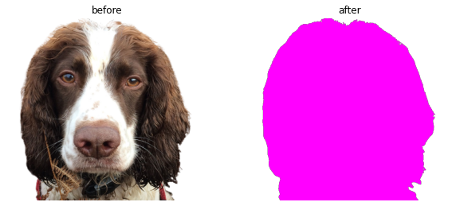

# imgtk

<!-- WARNING: THIS FILE WAS AUTOGENERATED! DO NOT EDIT! -->

This file will become your README and also the index of your
documentation.

## Install

``` sh
pip install imgtk
```

## How to use

[`recolor`](https://alexlewzey.github.io/imgtk/imgtk.html#recolor) sets
color of non-blank image pixels to a single rgb value.

``` python
dir_img = Path("images").absolute()
recolor(dir_img / "mole-no-background.png", dir_img / "mole-pink.png", (255, 0, 255))

imgs = [Image.open(dir_img / f) for f in ["mole-no-background.png", "mole-pink.png"]]
_, axs = plt.subplots(1, 2, figsize=(10, 18))
axs = axs.flatten()
for img, ax, title in zip(imgs, axs, ["before", "after"]):
    ax.imshow(img)
    ax.axis("off")
    ax.set_title(title)
plt.show()
```



`pixel_color()` will copy the color of the current mouse cursor position
to the clipboard.

``` python
# pixel_color()
# pyperclip.paste()
```

    '(42, 42, 42)'

The color can be returned in either rgb or hex format.

``` python
# pixel_color('hex')
# pyperclip.paste()
```

    '#181818'
